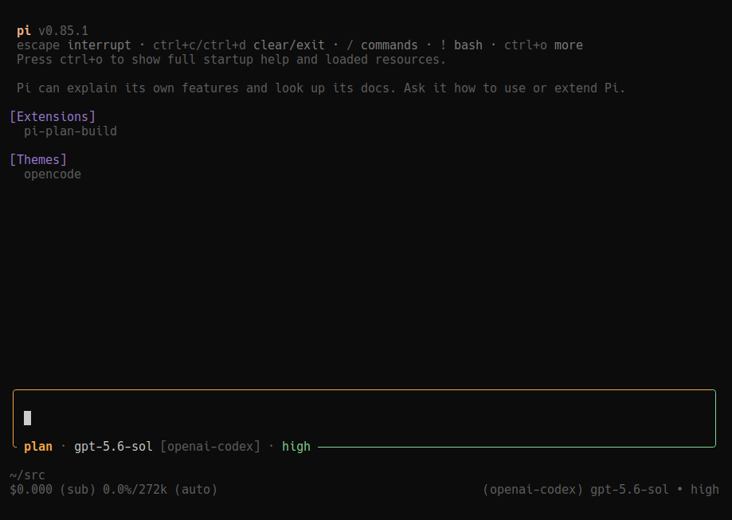
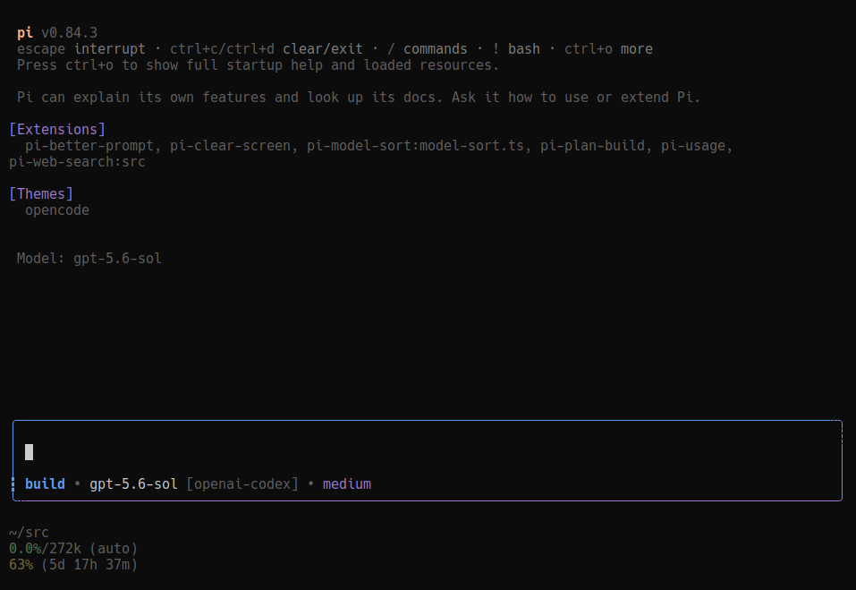

# Pi Plan & Build

**Plan safely, approve explicitly, then implement here or in a clean session.**

A [Pi coding agent](https://github.com/earendil-works/pi-mono) extension with persistent Plan/Build modes, one current unfinished plan, guarded plan-file editing, interactive questions, complete plan review, and optional step execution.

## Workflow

1. Start in **Build** for ordinary discussion and coding. Small fixes need no plan.
2. Select **Plan** with `/plan`, `Alt+M`, or the default editor `Tab` shortcut. This changes permissions, **not task selection**. Discuss and research read-only; no Markdown is written merely by entering Plan.
3. When you request a planning deliverable or accept a concrete proposed change during planning, the agent creates the current task; `/plan new` is the manual equivalent. It waits for the returned canonical path, completes necessary read-only investigation, saves the plan, and calls `plan_exit` for review and implementation approval. Accepting scope does not authorize implementation; informational agreement alone creates no task. You need not say “make a plan” again or switch manually to Build to get a plan written.
4. Approve implementation **here**, in a **clean linked session**, or **step by step** (experimental fullscreen UI). Staying in Plan—or Escape—stops the run and waits for your next message.
5. After implementation and required verification, the agent records completion. Essential user-only validation keeps the same plan attached, with an **awaiting validation notice in the main chat** and precise instructions. Optional feedback does not hold completion open.

One task retains its file, identity, decisions, and progress through mode changes and revisions. Approval and idleness never imply completion. Before starting another plan, complete the current plan or explicitly abandon it. Abandonment preserves the file but never implies success and cannot be resumed. **Pausing step execution** is separate: it retains the current plan and progress but permits no implementation until execution is resumed.

## Presentation

### Plan



### Build



The rounded composer uses the current theme’s `warning` color in Plan and `thinkingLow` in Build on the top-left border and continuous solid `│` left rail. The right rail uses Pi’s border color. The unfinished attached task’s title sits in the top border; mode, model, provider, and thinking level sit in the bottom border. Text truncates to terminal width. Model/thinking changes update the display live.

When enabled, titles stay through mode changes and execution pauses, disappear on completion/abandonment, and change only when the task identity changes. Validation notices belong in the main chat, never in the composer title or border. Metadata takes precedence over the first nonempty top-level Markdown heading outside fenced code. An existing unfinished file without a title displays `Untitled task`; empty reservations do not. No scope is inferred from the display fallback.

Submitted user messages retain their original mode-colored rail after mode changes and session restoration. Recreated custom editors restore the latest 100 active-branch user prompts for Up/Down history. Pi Plan Build leaves the footer untouched; its keyed status is a fallback when another extension owns the composer.

Compatible editor decorators may invoke Plan Build’s editor factory and retain its composer. A preexisting editor, non-composing replacement, or competing fullscreen layout triggers one warning and reduced optional UI rather than replacing the other owner. Core modes, tools, shortcuts, and restored step progress remain available. Teardown restores only UI slots still owned by Plan Build.

## Requirements and installation

- Pi **0.84.2+**; Node.js **22.6+** for the test command.
- TUI or RPC UI for interactive questions and approval.
- Fullscreen TUI and at least **132 columns** to start the optional step panel.

```bash
pi install npm:@janvitos/pi-plan-build
# Or:
pi install git:github.com/janvitos/pi-plan-build
```

Start Pi again or run `/reload`. npm packages live under `~/.pi/agent/npm/`; `~/.pi/agent/extensions/` is for directly discovered extensions.

For local development:

```bash
git clone https://github.com/janvitos/pi-plan-build.git ~/src/pi-plan-build
ln -s ~/src/pi-plan-build ~/.pi/agent/extensions/pi-plan-build
```

Do not load multiple npm/Git/local copies simultaneously.

## Commands and shortcuts

| Action | Result |
| --- | --- |
| `Alt+M` | Default global Build/Plan toggle |
| `Tab` | In the custom composer, toggle when autocomplete is closed; accept a suggestion when open |
| `/plan-settings` | Configure shortcuts and plan title visibility |
| `/plan` | Select read-only Plan mode without allocating a task |
| `/plan new` | Start a plan only when no current unfinished plan exists |
| `/plan abandon` | Confirm explicit abandonment; preserve the file without implying success |
| `/plan list` | Show the current plan and its state |
| `/plan done` | In Build, explicitly mark the saved implementation complete |
| `/build` | Select Build mode |
| `pi --plan` | Start in Plan mode |
| `/build-fresh` | Retry a pending clean-session implementation |

Lifecycle commands require an idle agent. Manual mode changes during a run are deferred: the composer shows the selected mode while current tool permissions and model guidance retain that run’s effective mode. `plan_enter` and approval transitions change the current continuation directly.

### Shortcut configuration

`/plan-settings` offers **Tab + Alt+M**, **Alt+M only**, **Disabled**, **Plan title**, and **Custom (edit config file)**. Saving preserves unrelated settings; cancellation changes nothing. Malformed JSON is never overwritten. Run `/reload` to apply saved changes.

Pi Plan Build reads `~/.pi/agent/pi-plan-build.json` (or `$PI_CODING_AGENT_DIR/pi-plan-build.json`):

```json
{
  "shortcuts": {
    "toggleMode": ["alt+m"],
    "toggleModeInEditor": ["tab"]
  }
}
```

Composer-outline plan titles are **off by default**. Enable **Plan title → On** in `/plan-settings`, or set `"showPlanTitle": true` in `pi-plan-build.json`, then run `/reload`. Choose **Off (default)** to hide them again. The preference also controls fallback status titles. Enabled composer titles use **regular lowercase, warning-colored text**. Saved titles, other title displays, validation labels, and user input keep their original lettering. Agents are guided to use concise, descriptive plan titles that make the task recognizable when returning to the session: include context needed for clarity, omit filler and unnecessary detail, and never sacrifice meaning merely to shorten the title. The former `smallCapsPlanTitle` setting is ignored and can be removed from existing configuration files.

Each action accepts one Pi key string or an array. `[]` disables it; omitted actions retain defaults. `toggleMode` uses Pi’s global shortcut conflict rules. `toggleModeInEditor` requires the custom composer and yields to open autocomplete. For example, use `"toggleMode": "ctrl+alt+m"` and `"toggleModeInEditor": ["f6"]`.

**Tab tradeoff:** the default replaces Pi’s closed-menu file-completion trigger (`Review READ` + Tab). Choose **Alt+M only** to restore that trigger. Never put bare Tab in global shortcuts: it would intercept open-menu completion too. Avoid assigning a key to both actions if editor-only autocomplete protection matters.

Use Pi `modifier+key` syntax (`ctrl+shift+m`, `f6`; navigation names include `pageUp`/`pageDown`). Unsupported matcher forms such as `+`/`ctrl++`, modified Escape, and modified function keys are rejected. Terminal support determines advanced modifier behavior. Invalid JSON or bindings warn and use defaults for affected actions.

## Task identity, files, and boundaries

Canonical plans live at `~/.pi/agent/plans/<session-id>-001.md`, `-002.md`, etc. Existing unnumbered `<session-id>.md` files remain usable without renaming. Reserved paths are for future writing, not proof that a file exists. Context distinguishes saved, absent, and unavailable files. An unavailable file never justifies discarding its task.

`plan_task` provides `list`, `update`, `include`, `discussion`, Plan-only `new`, and explicit `abandon`. Mutations require `expectedAttached` (current sequence or `null`; legacy `sequence` remains accepted). Stale calls fail without retargeting. Abandonment requires explicit user direction and a concise reason. Deprecated `pause`/`resume` inputs are accepted only to return non-mutating upgrade guidance. Transitions must finish in a separate tool batch before dependent edits or shell calls.

The agent establishes a concise title/scope once. Later updates are only for user-driven material deliverable/constraint changes, explicit renames, or mistaken-identity corrections—not progress, findings, techniques, or message paraphrases. Those belong in conversation and the eventual plan. `include`/`discussion` record explicit task-boundary decisions.

Questions, research, tangents, and related changes assume continuity. For a concrete independent deliverable, the agent asks whether to include it or finish/abandon the current plan before starting another. Discussion alone needs no lifecycle change; unanswered questions grant no consent. Boundary judgment is agent-assisted, not an automatic topic detector.

Build edit/write guards protect every tracked current or historical plan file.

### Persistence and model context

One versioned collection stores records, the current attachment, and the allocation high-water mark; no duplicate current-plan or execution mirrors are saved. Meaningful transitions save a snapshot once; identical snapshots, reads, lists, and ordinary model requests do not. Restoration retains completed/abandoned records, unsaved metadata/outcomes, and step progress. Old detached records from the former multi-plan workflow remain untouched as hidden inert history: they are not listed, counted, resumed, selected, or migrated. Malformed modern state is reported and disables mutations instead of falling back to partial data.

Reload/tree navigation restores branch state while allocation honors the session-wide high-water mark and existing files. Forks copy tracked files to child paths without overwriting source files. Fresh implementation transfers **only the current approved plan**, not historical records or planning conversation.

The `context` hook refreshes one current mode/task block before each model request. Because Pi converts custom messages to user-role messages, this background block is placed before the latest actual user request (or at the beginning if none remains), never after its tool results. It requires no acknowledgment. Obsolete extension-owned reminders are filtered from outgoing context without deleting transcript history. Build with no current plan receives none. Current contexts include outcome facts and, when applicable, executable-step or execution-waiting restrictions. Awaiting-validation context includes the exact required user action until it is resolved. File facts refresh at restoration, current selection, canonical edit/write results, and user-run boundaries; action-time safety checks do not rely on display caches.

## Approval and completion

`plan_exit` renders the **complete** saved plan in the TUI transcript; in RPC, it includes the complete review in the blocking selection request's title. RPC clients control how that title is displayed. It then asks to:

- **Switch to Build and implement here**
- **Start fresh and implement**
- **Stay in Plan mode**
- **Implement step by step**, when supported

Each choice displays one next-action announcement. Fresh implementation announces in the destination **below the transferred plan and above the first assistant response**; other choices announce in the source. TUI announcements are durable; RPC receives notifications. Reload does not replay them.

Fresh selection stops the source run and dispatches `/build-fresh`, which creates a linked session with an immutable approved-plan/model/thinking/task snapshot. It uses the destination context after replacement. Cancellation leaves the source request retryable; setup/kickoff failures put the request in the destination editor rather than falsely announcing success.

Staying or Escape says “I’ll stay in Plan mode and wait for your next instruction,” terminates the run, and waits.

The implement-here approval result explicitly instructs execution within the approved authorization boundaries; acknowledgment or initial inspection alone is not completion. Separate deployment/restart approvals still apply, and genuine blockers or interruptions may stop work. Ordinary Build discussion does not itself authorize implementation.

For normal implementation, the agent calls `plan_complete` after all approved work and required verification pass. `/plan done` is the manual equivalent. Completion does not require saved Markdown; metadata-only plans can complete too. Missing or unavailable files are not evidence that work finished and do not alone require extra confirmation. If missing scope prevents assessing completion, the agent records `blocked`. Explicit user-directed closure closes tracking without claiming unperformed checks passed. Build-mode, attachment, usable-state, and step-execution guards still apply.

`plan_finish` records unfinished outcomes:

- `awaiting_validation`: requires an essential `userAction` and keeps the plan attached and open, with the required action shown in the main chat until resolved.
- `blocked`, `waiting_for_input`, `still_working`: record a reason and keep the plan attached.

The collapsed tool result says only **Validation request recorded.** Expanded results retain the complete required actions, rationale, and plan path, with readable instruction text. The assistant's final response summarizes implementation and checks, provides all essential validation actions once, and ends with **Awaiting your validation.** During step execution it describes only the active step, not the whole plan as finished. Full requirements remain in structured tool details and current context. This response ordering is agent guidance, not automatic rewriting of model output. A successful user report resolves the validation request; this same plan can complete directly only when all approved work and required verification are finished, or the user explicitly directs completion. A failed report keeps it current for remediation. Optional appearance feedback is not required validation.

A normal saved-plan Build run can receive **one** hidden outcome-reconciliation reminder after approved implementation or a successful project edit/write. It requires a normal terminal response and no recorded outcome. Errors, interruptions, pending input, work without a current plan, conversation-only turns, Plan, and step execution do not trigger it. The reminder authorizes no more implementation/tests and infers no success. Its instruction is visible only during its live bookkeeping follow-up, including the final response after recording an outcome. It expires when that follow-up settles, when a new user message arrives, or when the plan/mode changes; restoration never reactivates it. Its consumed marker is saved before dispatch, preventing replay across restoration; ignoring it leaves the plan unfinished without looping. Shell-only work outside approval may not arm it, so explicit agent finishing remains the primary contract.

Tool output stays compact and preserves errors even during partial output. Expanded inventory and Markdown completion summaries retain specialized rendering. Interactive `question` supports structured choices and custom answers. Hidden model guidance is hidden in the normal UI, not inaccessible through session/API data.

## Step-by-step execution (experimental)


Enable fullscreen in Pi settings and restart:

```json
{ "tuiMode": "fullscreen" }
```

The passive **64-column** right panel reserves space rather than covering the transcript/editor. It wraps long instructions, collapses below 132 columns, never captures input, and shows persistent **How to use** guidance. Startup says: “Write ‘Proceed’ to start the first step. Instructions are shown at the bottom of the plan panel.”

Plans end with discrete top-level instructions:

```markdown
## Implementation Steps
1. Add the parser.
2. Integrate the workflow.
3. Run focused verification.
```

Legacy unchecked `- [ ]` items remain supported; checked/nested items and fenced examples are ignored. Duplicate instructions are rejected. Revisions preserve markers/newline formatting and reject stale or reordered source content without writing different bytes.

Use ordinary prompts: “Proceed,” “Start step 2,” “I already verified this step,” “Change step 3 to …,” “Skip this step,” “Pause execution,” “Resume execution,” “Hide/show the panel,” or “Cancel step execution.” The agent interprets clear intent; hypothetical or ambiguous discussion does not advance progress.

`plan_step_control start` approves a ready step. The agent implements **only that step**, verifies applicable behavior, calls `plan_step_complete`, and waits before the next. Explicit manual completion of a ready step records already-done work; it does **not** authorize implementation. Paused active steps retain progress but cannot authorize edit/write/bash/powershell mutations or receive implementation instructions until explicitly resumed. Essential user validation pauses execution—not the plan—and keeps the active step. A successful report may complete that step without authorizing further implementation; a failed report resumes the same step for remediation.

Progress, summaries, revisions, and panel visibility survive restoration. Completing/skipping the final step marks the plan complete, removes the panel/guards, and renders a Markdown summary. Cancelling step execution removes its guards/panel but leaves the plan unfinished and preserves any required validation request. Confirming that request does not imply that remaining plan steps are complete. In regular/reduced UI, restored progress remains controllable through prompts; no overlay fallback is used.

The layout integration uses public fullscreen primitives plus a guarded read of the runtime layout root, since Pi’s API currently exposes a setter but no getter. Ownership is checked before installation and teardown.

## Permission and verification limits

Plan guidance allows only observation, analysis, discussion, and planning. Built-in edit/write calls may target **only the attached canonical plan path**, and only finalization or explicitly requested revision is appropriate. Other tools remain visible for exploration. Bash/powershell are not sandboxed in ordinary Plan mode: the read-only requirement is model guidance, not arbitrary shell classification.

Build keeps tracked Markdown read-only; completion belongs in extension state. Edit/write guards normalize Pi path forms (including `@` and `~`) and resolve filesystem symlink aliases, including existing parents of new files. Unresolvable targets fail closed. These guards are not an arbitrary-shell sandbox or protection against adversarial filesystem races. Extension-controlled revisions of unimplemented step instructions remain supported and share Pi’s file-mutation queue.

Plans include a brief `## Verification` section with standalone **Agent** and, only when essential, **User** labels. Use the smallest sufficient behavior check with repository-supported commands and expected observations; prose-only changes may use inspection. Build/type-check alone does not prove runtime behavior. Add checks only for a concrete risk, observed failure, or explicit requirement. Reuse passing results, disclose deferrals and blocked/unperformed checks, and stop after approved required checks pass. Do not downgrade essential user validation to finish. These are model instructions, not guaranteed test limits; repository/CI requirements still apply.

## Development and release

```bash
npm test
npm pack --dry-run
```

The Node suites cover accumulated context, canonical persistence and inert legacy records, branch allocation, tool-event ordering and guards, awaiting validation, paused execution, Markdown parsing/revision, UI ownership/width, shortcuts/autocomplete/history, transcript rails, questions, handoff ordering/recovery, and bounded reconciliation.

Runtime responsibilities are split between `plan-state.ts`, `plan-context.ts`, `plan-markdown.ts`, `plan-execution.ts`, `composer.ts`, `handoff.ts`, and `tool-presentation.ts`; `index.ts` wires commands, tools, and events. Smaller question/panel/shortcut/rail modules remain independent.

Releases use `.github/workflows/publish.yml`: a `vX.Y.Z` tag must match `package.json` before publishing. `prepublishOnly` runs tests. After publication, the workflow downloads the exact version’s registry tarball and verifies its internal name/version, with six attempts, ten-second intervals, and request timeouts. If availability cannot be confirmed, it reports that publication may already have succeeded; it never automatically unpublishes, bumps again, or republishes. This post-publication path requires a release to exercise end to end.

## Attribution and license

Independent of Pi and OpenCode. Conversational read-only planning follows OpenCode’s Plan agent; persisted finalization/approval are Pi adaptations. Earlier semantics were informed by OpenCode 1.18.16 and clean-session handoffs by the former `pi-plan-mode` extension. The guarded transcript-rail integration decorates Pi’s exported `UserMessageComponent` because no built-in user-message renderer hook exists. No bundled subagents are required.

[MIT](LICENSE)
