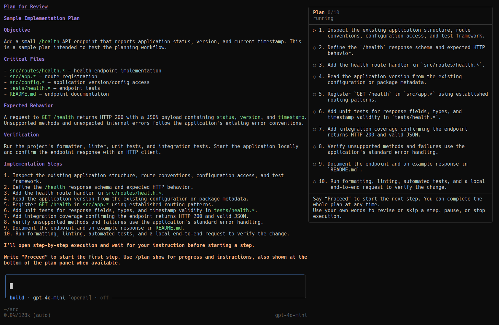

# Workflow and plan lifecycle

[← README](../README.md)

## Overview

1. Start in **Build**, or in your configured [**Default mode**](settings.md#default-startup-mode), for ordinary discussion and coding. Small fixes need no plan.
2. Select **Plan** with `/plan`, `Alt+M`, or the default editor `Tab` shortcut. This changes permissions, **not task selection**. Plan entry is user-controlled: the agent cannot auto-route a Build request into Plan, so a planning request made in Build requires you to switch modes. Discuss and research read-only; no Markdown is written merely by entering Plan.
3. When you request a planning deliverable or accept a concrete proposed change during planning, the agent creates the current task; `/plan new` is the manual equivalent. It waits for the returned canonical path, completes necessary read-only investigation, saves the plan, and calls `plan_exit` for review and implementation approval. Accepting scope does not authorize implementation; informational agreement alone creates no task. You need not say “make a plan” again or switch manually to Build to get a plan written.
4. Approve implementation **here**, in a **clean linked session**, or **step by step** (experimental; sidebar optional). Staying in Plan—or Escape—stops the run and waits for your next message.
5. After implementation and required verification, the agent records completion. Essential user-only validation keeps the same plan attached, with a bold accent **Awaiting your validation** heading at the end of the turn and precise regular-color instructions beneath it. Optional feedback does not hold completion open.

One task retains its file, identity, decisions, and progress through mode changes and revisions. Approval and idleness never imply completion. Before starting another plan, complete the current plan or explicitly abandon it. Abandonment preserves the file but never implies success and cannot be resumed. **Pausing step execution** is separate: it retains the current plan and progress but permits no implementation until execution is resumed.

## Task identity, files, and boundaries

Canonical plans live at `~/.pi/agent/plans/<session-id>-001.md`, `-002.md`, etc. Existing unnumbered `<session-id>.md` files remain usable without renaming. Reserved paths are for future writing, not proof that a file exists. Context distinguishes saved, absent, and unavailable files. An unavailable file never justifies discarding its task.

`plan_task` provides `list`, `update`, `include`, `discussion`, Plan-only `new`, and explicit `abandon`. Mutations require `expectedAttached` (current sequence or `null`; legacy `sequence` remains accepted). Stale calls fail without retargeting. Abandonment requires explicit user direction and a concise reason. Deprecated `pause`/`resume` inputs are accepted only to return non-mutating upgrade guidance. Transitions must finish in a separate tool batch before dependent edits or shell calls.

The agent establishes an action-led, single-action title and the scope once. Later updates are only for user-driven material deliverable/constraint changes, explicit renames, or mistaken-identity corrections—not progress, findings, techniques, or message paraphrases. Those belong in conversation and the eventual plan. `include`/`discussion` record explicit task-boundary decisions.

Questions, research, tangents, and related changes assume continuity. For a concrete independent deliverable, the agent asks whether to include it or finish/abandon the current plan before starting another. Discussion alone needs no lifecycle change; unanswered questions grant no consent. Boundary judgment is agent-assisted, not an automatic topic detector.

Build edit/write guards protect every tracked current or historical plan file.

## Approval and completion

Before applying an implementation choice, `plan_exit` checks that the attachment, effective mode, and plan bytes still match what was reviewed. Changes or unreadable content require fresh review; this is only a dialog-time safeguard, not ongoing drift enforcement.

`plan_complete` accepts an optional factual `summary`, retained with the completed record for `/plan history`. Empty calls and `/plan done` remain supported; missing summaries are not evidence that verification passed. History does not reopen plans or expose inert legacy detached records.

`plan_exit` renders the **complete** saved plan in the TUI transcript; in RPC, it includes the complete review in the blocking selection request's title. RPC clients control how that title is displayed. It then asks to:

- **Switch to Build and implement here**
- **Start fresh and implement**
- **Stay in Plan mode**
- **Implement step by step**, when the plan contains valid implementation steps

Each choice displays one next-action announcement. Fresh implementation announces in the destination **below the transferred plan and above the first assistant response**; other choices announce in the source. TUI announcements are durable; RPC receives notifications. Reload does not replay them.

Fresh selection stops the source run and dispatches `/build-fresh`, which creates a linked session with an immutable approved-plan/model/thinking/task snapshot. It uses the destination context after replacement. Cancellation leaves the source request retryable; setup/kickoff failures put the request in the destination editor rather than falsely announcing success.

Staying or Escape says “I’ll stay in Plan mode and wait for your next instruction,” terminates the run, and waits.

The implement-here approval result explicitly instructs execution within the approved authorization boundaries; acknowledgment or initial inspection alone is not completion. Separate deployment/restart approvals still apply, and genuine blockers or interruptions may stop work. Ordinary Build discussion does not itself authorize implementation.

For normal implementation, the agent calls `plan_complete` after all approved work and required verification pass. `/plan done` is the manual equivalent. Completion does not require saved Markdown; metadata-only plans can complete too. Missing or unavailable files are not evidence that work finished and do not alone require extra confirmation. If missing scope prevents assessing completion, the agent records `blocked`. Explicit user-directed closure closes tracking without claiming unperformed checks passed. Build-mode, attachment, usable-state, and step-execution guards still apply.

`plan_finish` records unfinished outcomes:

- `awaiting_validation`: requires an essential `userAction` and keeps the plan attached and open, with the required action shown in the main chat until resolved.
- `blocked`, `waiting_for_input`, `still_working`: record a reason and keep the plan attached.

The collapsed tool result is suppressed so the turn ends with a single human-facing notice; expanding it shows the muted acknowledgement, the required action, rationale, and plan path. The required action is also multiline tool-result content (`Awaiting your validation`, followed by the action), so it stays available to the model, RPC, and JSON clients. The human-facing notice is appended after the assistant's summary: only its short **Awaiting your validation** heading is bold accent, followed by one empty line and the action as regular-color Markdown with normal wrapping. Both use Pi's standard one-column transcript inset, and list markers use the normal conversation Markdown style. Agents use one concise bullet per concrete check when validation has multiple checks; a single check can remain a short sentence. The assistant's final response summarizes implementation and checks without restating the action or adding a closing ceremony. During step execution it describes only the active step, not the whole plan as finished. Full requirements remain in structured tool details and current context. A successful user report resolves the validation request; this same plan can complete directly only when all approved work and required verification are finished, or the user explicitly directs completion. A failed report keeps it current for remediation. Optional appearance feedback is not required validation.

For hidden outcome reconciliation and compact tool rendering, see [Internals](internals.md#outcome-reconciliation).

## Inspect plans without a model turn

Use `/plan show` to read the current plan, progress, and outstanding validation. Use `/plan history` for completed or abandoned plans tracked on the active session branch, including recorded summaries. These idle commands do not approve implementation or reopen plans.

## Step-by-step execution (experimental)



Step execution works in regular/narrow TUI and RPC without a sidebar. For the optional sidebar, enable fullscreen in Pi settings and restart:

```json
{ "tuiMode": "fullscreen" }
```

The passive **64-column** right panel reserves space rather than covering the transcript/editor. It wraps long instructions, collapses below 132 columns, never captures input, and shows persistent **How to use** guidance. Startup asks you to say “Proceed” and points to `/plan show` for progress and instructions. The same workflow works without a sidebar; compact tool results describe each transition and RPC receives startup guidance.

Plans end with discrete top-level instructions:

```markdown
## Implementation Steps
1. Add the parser.
2. Integrate the workflow.
3. Run focused verification.
```

Legacy unchecked `- [ ]` items remain supported; checked/nested items and fenced examples are ignored. Duplicate instructions are rejected. Revisions preserve markers/newline formatting and reject stale or reordered source content without writing different bytes.

Use ordinary prompts: “Proceed,” “Start step 2,” “I already verified this step,” “Change step 3 to …,” “Skip this step,” “Pause execution,” “Resume execution,” “Hide/show the panel,” or “Cancel step execution.” The agent interprets clear intent; hypothetical or ambiguous discussion does not advance progress.

`plan_step_control start` approves a ready step. The agent implements **only that step**, verifies applicable behavior, calls `plan_step_complete`, and waits before the next. Explicit manual completion of a ready step records already-done work; it does **not** authorize implementation. Paused active steps retain progress but cannot authorize edit/write/bash/powershell mutations or receive implementation instructions until explicitly resumed. Essential user validation pauses execution—not the plan—and keeps the active step. A successful report may complete that step without authorizing further implementation; a failed report resumes the same step for remediation.

Progress, summaries, revisions, and panel visibility survive restoration. Completing/skipping the final step marks the plan complete, removes the panel/guards, and renders a Markdown summary. Cancelling step execution removes its guards/panel but leaves the plan unfinished and preserves any required validation request. Confirming that request does not imply that remaining plan steps are complete. In regular/reduced UI, restored progress remains controllable through prompts; no overlay fallback is used.

See [UI internals](internals.md#presentation-and-ui-compatibility) for sidebar ownership and layout integration.

## Permission and verification limits

Plan guidance allows only observation, analysis, discussion, and planning. Built-in edit/write calls may target **only the attached canonical plan path**, and only finalization or explicitly requested revision is appropriate. Other tools remain visible for exploration. Bash/powershell are not sandboxed in ordinary Plan mode: the read-only requirement is model guidance, not arbitrary shell classification.

Build keeps tracked Markdown read-only; completion belongs in extension state. Guarded revisions of unimplemented steps remain supported. See [Permission boundary](internals.md#permission-boundary) for path normalization, symlink handling, and enforcement limits.

Plans include a brief `## Verification` section with standalone **Agent** and, only when essential, **User** labels. Use the smallest sufficient behavior check with repository-supported commands and expected observations; prose-only changes may use inspection. Build/type-check alone does not prove runtime behavior. Add checks only for a concrete risk, observed failure, or explicit requirement. Reuse passing results, disclose deferrals and blocked/unperformed checks, and stop after approved required checks pass. Do not downgrade essential user validation to finish. These are model instructions, not guaranteed test limits; repository/CI requirements still apply.

For persistence, context, and UI ownership details, see [Internals](internals.md). For model/thinking preferences, see [Settings](settings.md).
